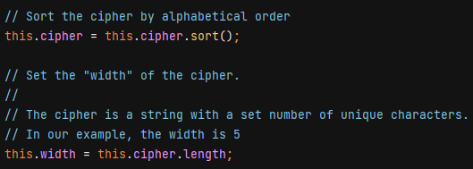

# Contributing
---

***Use a separate branch for development with the following naming convention***

```
- bugfix-some-unique-branch-name
- hotfix-some-unique-branch-name
- feature-some-unique-branch-name
```

1. clone this repo
1. install dependencies (jest for tests) `npm install`
1. create a new branch named `[type]-[name]` (see example below)
1. commit your changes
1. run tests `npm run test`
1. push your branch to the remote repository
1. create a pull request

---

## Run tests

`npm run test`


---

## Run encryption from command line

`npm run encrypt`


---

## Minify

Until I finalize the pipeline, builds are performed manually.

`npm run build`

Please keep the following in mind when developing:

- Add tests for modified or additional code
- Keep code bloat to a minimum, the final minified code should remain very small
- Maintain a consistent style
- Use no dependencies
- Comment everything (see example)

